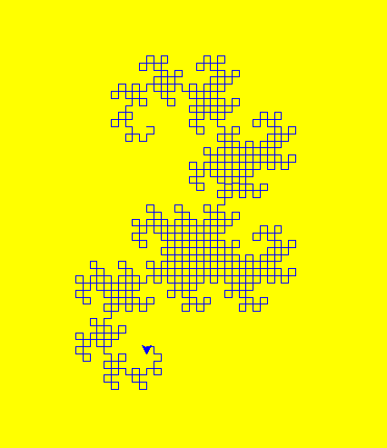
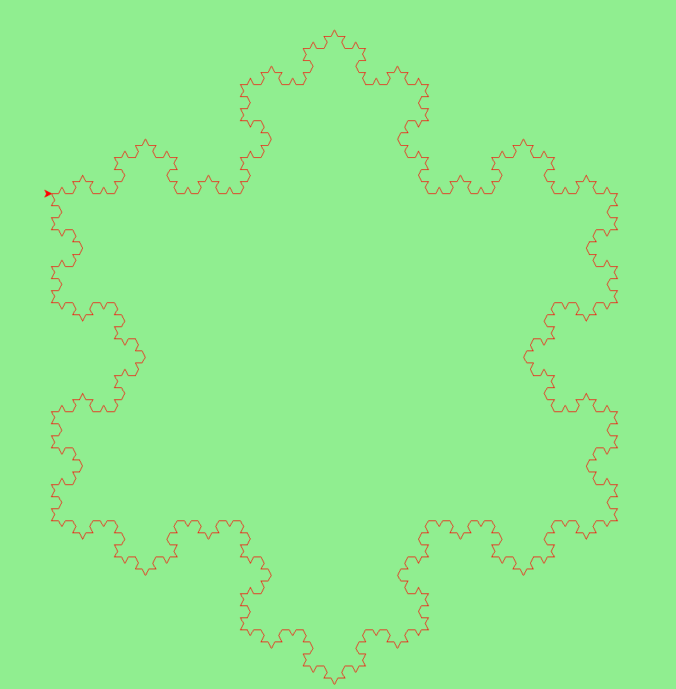
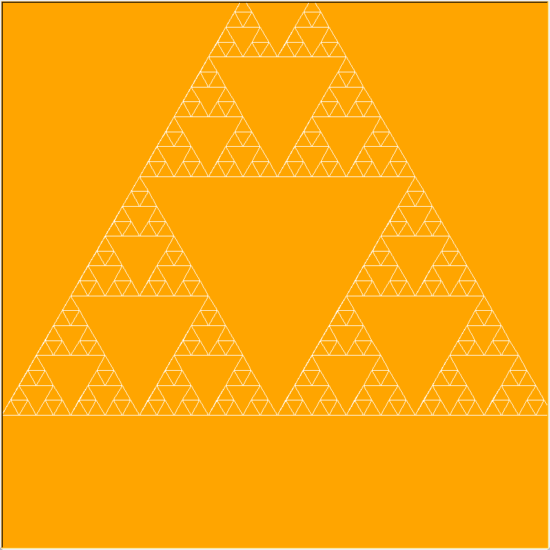

# Fraclang
An innovative domain-specific language that is specifically designed to make it
easier for both experts and novices to generate stunning fractals. With its intuitive grammar and user-friendly interface, The language is accessible to users with varying levels of experience, making it an
ideal tool for anyone interested in exploring the fascinating world of fractals.
What makes FracLang stand out from other programming languages is its ability to simplify
the complex task of generating fractals. 

## Dependencies
FracLang requires the following dependencies:
* [Python 3.6 or higher](https://www.python.org/downloads/)
* [Turtle graphics library](https://docs.python.org/3/library/turtle.html)

## Usage
To use FracLang, simply download the source code and run the following command in the src directory:
```
py main.py <input_file>.txt
```

## Examples
### Heighway Dragon
```
size 500
color 'blue'
background 'white'
shape 'dragon'
scale 0.5
rotate 30
draw 1000
```



### Koch Snowflake
```
size 800
color 'red'
background 'lightgreen'
shape 'snowflake'
draw 0
```



### Sierpinski Triangle
```
size 800
color 'white'
background 'orange'
shape 'triangle'
scale 2
draw 0
```




